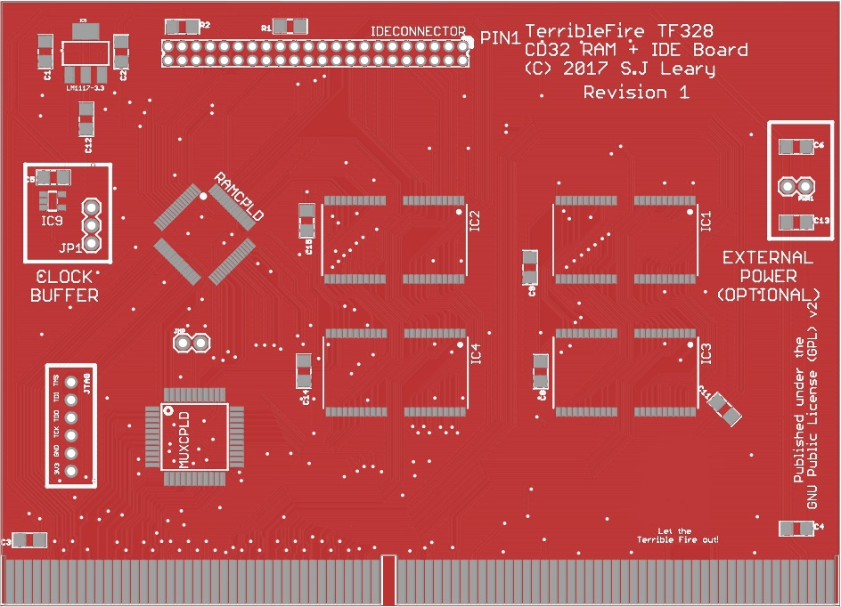

# TF528 Revision 1

WARNING: This board is beta. It has not been verified at time of commiting. 

A prototype version was built and this contains all the lessons learned from that prototype. 

This repository contains all the files needed to produce a copy of my IDE+RAM board.

The CPLDs Required are 1 x XC9572XL-10VQ64 and 1 x XC9536XL-10VQG44C.  10ns "Commercial" version is fine.

Everything in this repository is released under the GNU GPLv2. You may create or base commercial PCBs from the work in this repository but you must make the sources for all derivative work available. I have noticed some forks have removed copyright notices. This is a breach of the GPL.

## Board Options

### Clock Buffer 

The clock buffer is a stabilty modification I added to buffer the clock due to slow rise times observed on other Amiga Hardware. It may not be required at all. If you decide not to add the clock buffer then you should jumper the middle pin of the CLOCKSEL jumper to the pin nearest the edge connector. If you wish to use the buffered clock you need to add IC9 and jumper the middle pin to the position nearest the IDE connector. If you wish to disable the board remove the jumper entirely.

### External Power

Jumper PWR1 is intended for use when bringing up the board so that the CPLDs can be programmed without inserting the card. It is not required after this unless you wish to use it to power other devices. 

### JMP Feature 

Jumper JMP is intended to trigger an NMI. This works via the MUXCPLD which detects the external pin being pulled HIGH and will pull IPL0-2 low until released. This feature is done synchronously to prevent glitches. It is intended for use with HRTMon. 

## Firmware / Requirements

  * Xilinx ISE, 14.7 (the final version - other versions may work but this is the one I support)
  * JTAG Adaptor

[For more information visit my channel](https://www.youtube.com/c/TerribleFire)

## License

This project and all the files contained are released under the GNU GPLv2. If you build a modified version of the board you must supply the end user with all the sources (this can be a web link).

## The TerribleFore 328 board (Revision 1)

Completely untested board link.... use with caution!!!! Do not come crying to me if it didnt work!!

http://dirtypcbs.com/store/designer/details/12476/4714/tf328-rev1-zip

The TF328 CD32 Ram + IDE Board

# Bill of Materials

|Part | Value | Device | Package | Description |
|-----|-------|--------|---------|-------------|
| R1 | 1K | RESISTOR1206 | 1206 | Resistors | 
| R2 | 1K | RESISTOR1206 | 1206 | Resistors | 
| C1 | 10uF | CAP_CERAMIC1206 | 1206 | Ceramic Capacitors | 
| C2 | 10uF | CAP_CERAMIC1206 | 1206 | Ceramic Capacitors | 
| C3 | 10uF | CAP_CERAMIC1206 | 1206 | Ceramic Capacitors | 
| C4 | 22uF | CAP_CERAMIC1206 | 1206 | Ceramic Capacitors | 
| C5 | 100nF | CAP_CERAMIC1206 | 1206 | Ceramic Capacitors | 
| C6 | 22uF | CAP_CERAMIC1206 | 1206 | Ceramic Capacitors | 
| C7 | 1uF | CAP_CERAMIC1206 | 1206 | Ceramic Capacitors | 
| C8 | 100nF | CAP_CERAMIC1206 | 1206 | Ceramic Capacitors | 
| C9 | 100nF | CAP_CERAMIC1206 | 1206 | Ceramic Capacitors | 
| C10 | 10uF | CAP_CERAMIC1206 | 1206 | Ceramic Capacitors | 
| C11 | 22uF | CAP_CERAMIC1206 | 1206 | Ceramic Capacitors | 
| C12 | 22uF | CAP_CERAMIC1206 | 1206 | Ceramic Capacitors | 
| C13 | 22uF | CAP_CERAMIC1206 | 1206 | Ceramic Capacitors | 
| C14 | 100nF | CAP_CERAMIC1206 | 1206 | Ceramic Capacitors | 
| C15 | 100nF | CAP_CERAMIC1206 | 1206 | Ceramic Capacitors | 
| C16 | 1uF | CC0603 | C0603 | CAPACITOR, European symbol | 
| IC1 | IS41C16100C | IS41C16100C | TSOP44(50)-II |   |
| IC2 | IS41C16100C | IS41C16100C | TSOP44(50)-II |   |
| IC3 | IS41C16100C | IS41C16100C | TSOP44(50)-II |   |
| IC4 | IS41C16100C | IS41C16100C | TSOP44(50)-II |   |
| IC5 | LM1117-3.3 | V_REG_LM1117SOT223 | SOT223 | Voltage Regulator LM1117 |
| IC9 | 74LVC1G17DBV | 74LVC1G17DBV | SOT23-5 | Single Schmitt-Trigger Buffer (Optional)| 
| JMP | Optional | JUMPER-2PTH | 1X02 | NMI Jumper | 
| JP1 | CLOCKSEL | JUMPER-3PTH | 1X03 |        | 
| JTAG | JTAG | HEADER-1X6ROUND | 1X06_ROUND | PIN HEADER | 
| PWR1 | EXT5V | JUMPER-2PTH | 1X02 | Jumper | 
| MUXCPLD | XC9536XL-10VQG44C | XC9536XL-10VQG44C | SQFP-S-10X10-44 | xc9536_pc44 XC9500 In-System Programmable CPLD Family | 
| RAMCPLD | XC9572XL-10VQ64 | XC9572XL-10VQ64 | VQ64 |  
| IDECONNECTOR | 87758-4416 | 87758-4416 | 87758-4416 | 44 Pin - 2mm Dual Row Single Wafer, Vertical T/H HDR |

